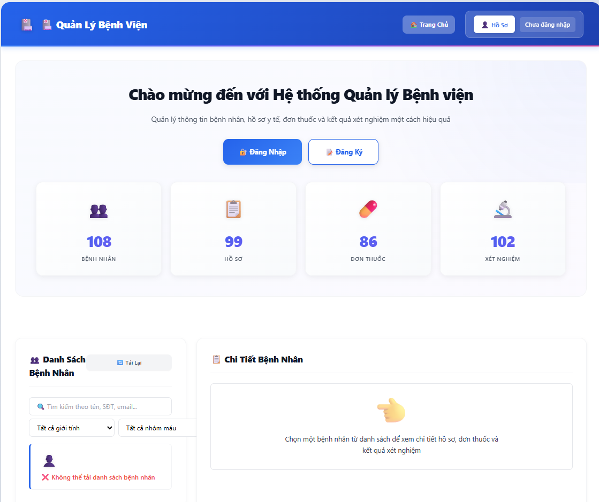
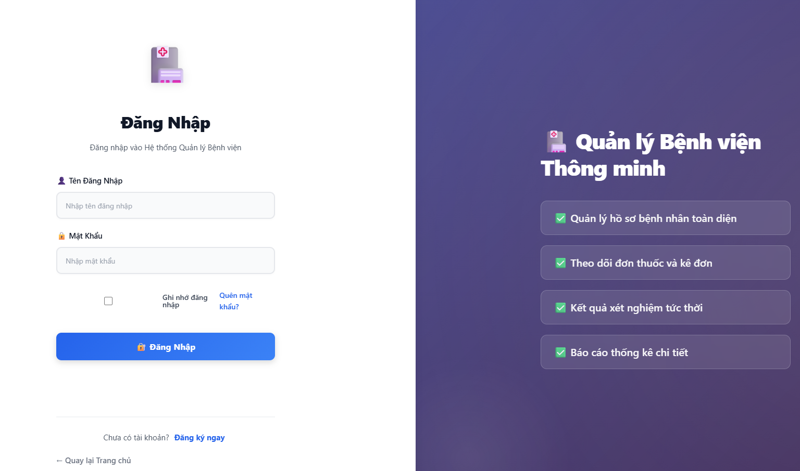
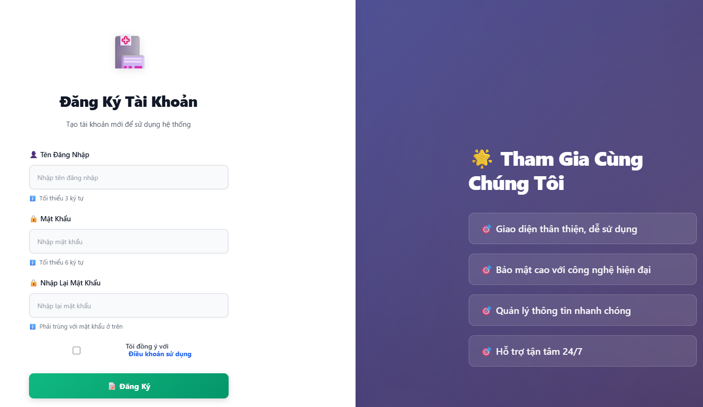
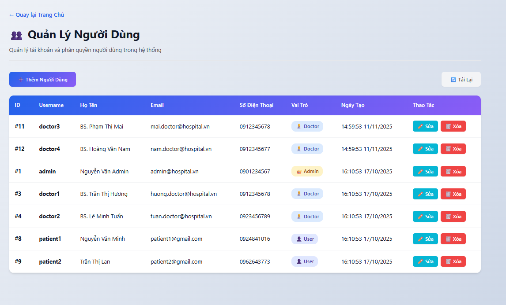
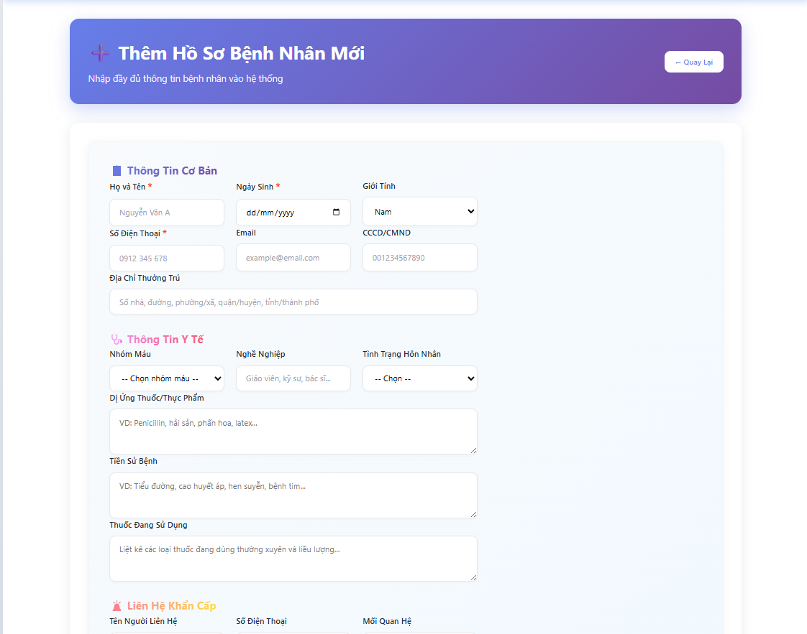
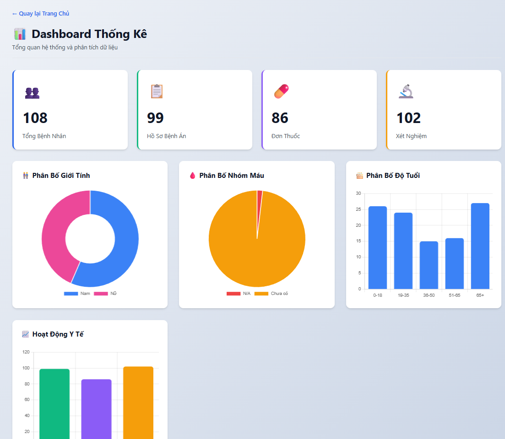
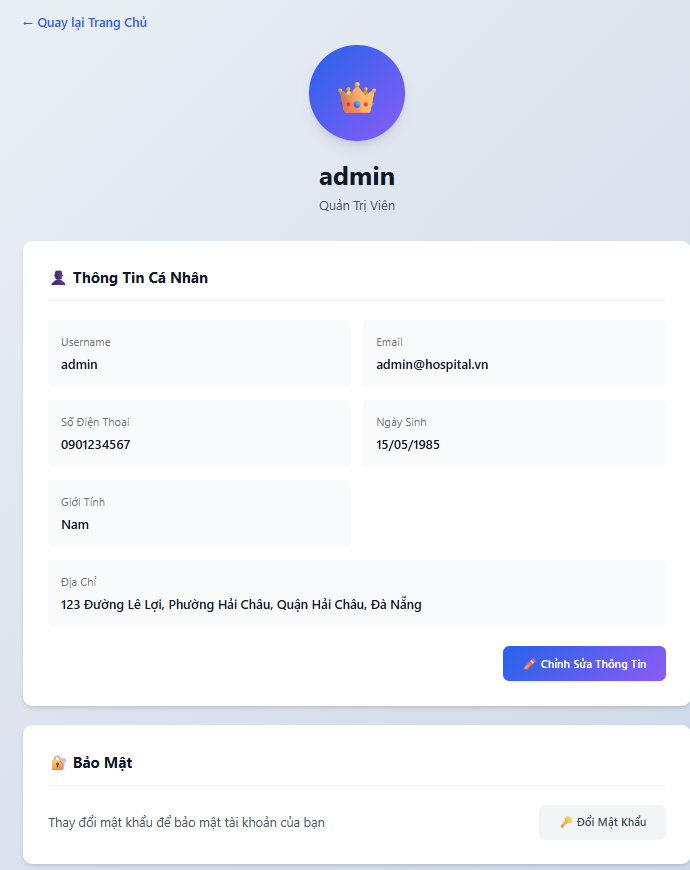
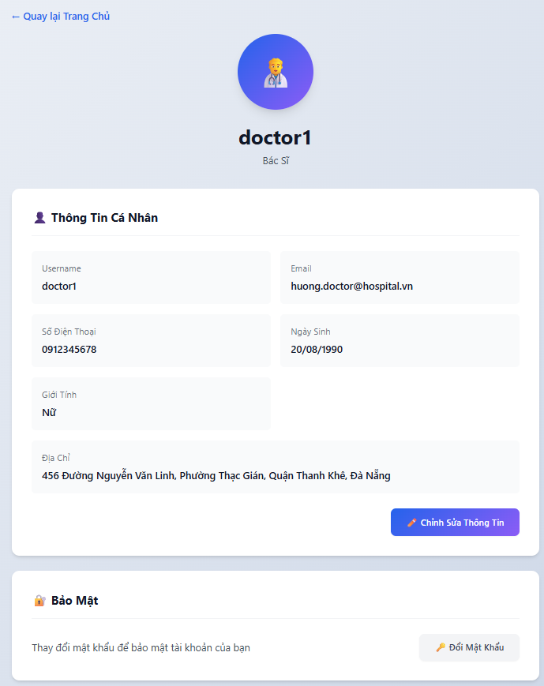
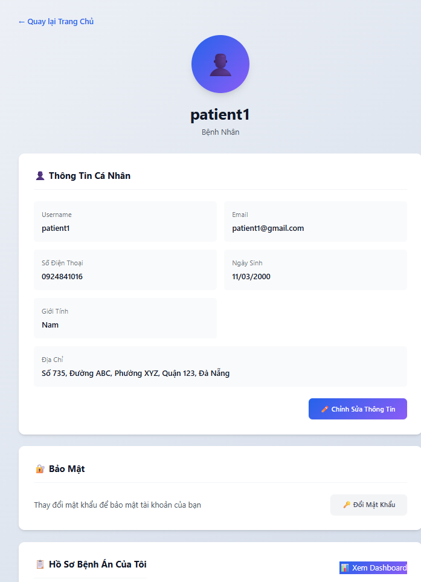

<h2 align="center">
    <a href="https://dainam.edu.vn/vi/khoa-cong-nghe-thong-tin">
    🎓 Faculty of Information Technology (DaiNam University)
    </a>
</h2>
<h2 align="center">
   XÂY DỰNG HỆ THỐNG QUẢN LÝ BỆNH ÁN ĐIỆN TỬ
</h2>
<div align="center">
    <p align="center">
        
        
        
    </p>

[](https://www.facebook.com/DNUAIoTLab)
[](https://dainam.edu.vn/vi/khoa-cong-nghe-thong-tin)
[](https://dainam.edu.vn)

</div>

---

## 📖 1. Giới thiệu

Hệ thống quản lý bệnh án điện tử là một ứng dụng web toàn diện được phát triển nhằm số hóa và tối ưu hóa quy trình quản lý hồ sơ bệnh nhân tại các cơ sở y tế. Hệ thống cung cấp các tính năng:

- 🔐 **Xác thực & Phân quyền**: Hỗ trợ 3 vai trò (Admin, Doctor, Patient) với JWT authentication
- 👥 **Quản lý người dùng**: CRUD đầy đủ cho Admin, Doctor và Patient
- 🏥 **Quản lý bệnh nhân**: Lưu trữ thông tin chi tiết với 18+ trường dữ liệu
- 📋 **Hồ sơ bệnh án**: Quản lý records, prescriptions, lab results
- 📊 **Dashboard Analytics**: Biểu đồ trực quan hóa dữ liệu (Chart.js)
- 🔍 **Tìm kiếm & Lọc**: Tìm kiếm realtime, lọc theo nhiều tiêu chí
- 👤 **Profile System**: Chỉnh sửa thông tin cá nhân, đổi mật khẩu
- 🎨 **UI/UX hiện đại**: Toast notifications, loading overlay, confirm dialogs

---

## 🛠️ 2. Công nghệ sử dụng  

<div align="left">

### Backend Technologies


### Frontend Technologies


### Database & Tools


</div>

---

## 🚀 3. Một số hình ảnh hệ thống

### Trang chủ

<p align="center">
  
</p>

### Đăng nhập

<p align="center">
  
</p>

### Đăng ký

<p align="center">
  
</p>

### Quản lý người dùng 

<p align="center">
  
</p>

### Thêm hồ sơ bệnh nhân

<p align="center">
  
</p>

### Dashboard Analytics

<p align="center">
  
</p>

### Profile & Settings
1. Admin

<p align="center">
  
</p>

2. Doctor

<p align="center">
  
</p>

3. Patients

<p align="center">
  
</p>

---

## 📝 4. Các bước cài đặt

### 📋 Yêu cầu hệ thống
```
Node.js: v22.20.0 trở lên
MySQL: 8.0 trở lên
Browser: Chrome, Firefox, hoặc Edge (phiên bản mới nhất)
```

### 🔧 Hướng dẫn cài đặt

**Bước 1: Clone repository**
```bash
git clone https://github.com/PhamHgun-0709/CDS-1604-QL-Benhan-Dientu.git
cd CDS-1604-QL-Benhan-Dientu
```

**Bước 2: Cài đặt dependencies**
```bash
cd HospitalApp
npm install
```

**Bước 3: Cấu hình Database**
```bash
# Tạo database và import schema
mysql -u root -p < backend/database/schema.sql

# Chạy migrations
cd backend/database/migrations
node runTimestampsMigration.js

# Seed dữ liệu mẫu
cd ../seed
node seedAll.js
```

**Bước 4: Cấu hình kết nối database**
- Mở file `backend/db.js`
- Cập nhật thông tin kết nối MySQL (password)

**Bước 5: Khởi động ứng dụng**
```bash
# Terminal 1: Khởi động Backend (port 3000)
cd backend
node server.js

# Terminal 2: Khởi động Frontend (port 5000)
cd frontend
node simple-server.js
```

**Bước 6: Truy cập ứng dụng**
- Mở browser và truy cập: `http://localhost:5000`

### 🔑 Tài khoản đăng nhập mẫu

| Vai trò | Username | Password |
|---------|----------|----------|
| **Admin** | admin | Admin@123 |
| **Doctor** | doctor1 | Admin@123 |
| **Patient** | patient1 | Admin@123 |

### 📂 Cấu trúc thư mục

```
HospitalApp/
├── backend/                    # Backend Node.js + Express
│   ├── controllers/           # 5 controllers (user, patient, record, prescription, lab)
│   ├── routes/               # API routes với authentication
│   ├── middleware/           # JWT authentication middleware
│   ├── database/             # Schema và migrations
│   ├── seed/                 # Scripts seed dữ liệu mẫu
│   ├── db.js                 # MySQL connection pool
│   └── server.js             # Express server entry point
│
├── frontend/                  # Frontend vanilla JavaScript
│   ├── index.html            # Trang chủ - Danh sách bệnh nhân
│   ├── login.html            # Trang đăng nhập
│   ├── register.html         # Trang đăng ký
│   ├── profile.html          # Trang hồ sơ cá nhân
│   ├── admin-users.html      # Quản lý users (Admin)
│   ├── admin-dashboard.html  # Dashboard analytics
│   ├── add-patient.html      # Form thêm bệnh nhân
│   ├── api.js                # API call functions
│   ├── auth.js               # Authentication helpers
│   ├── main.js               # Main application logic
│   ├── patients.js           # Patient management logic
│   ├── ui-helpers.js         # Toast, Loading, Confirm dialogs
│   ├── style.css             # Styling toàn ứng dụng
│   └── simple-server.js      # Static file server
│
└── docs/                      # Documentation
    └── README.md             # Chi tiết về project
```

### 🎯 Tính năng chính

#### 🔐 Authentication & Authorization
- JWT token authentication (8 giờ expiry)
- Role-based access control (Admin/Doctor/Patient)
- Forgot/Reset password với token validation

#### 👥 User Management (Admin)
- View tất cả users với role badges
- CRUD operations (Create, Read, Update, Delete)
- Timestamps tracking (created_at, updated_at)

#### 🏥 Patient Management (Admin/Doctor)
- Danh sách bệnh nhân với pagination
- Form thêm bệnh nhân (18+ fields)
- Tìm kiếm realtime theo tên, phone, địa chỉ
- Lọc theo giới tính và nhóm máu

#### 📋 Medical Records
- Xem hồ sơ bệnh án (diagnosis, treatment)
- Thêm đơn thuốc (medicine, dosage, frequency)
- Thêm kết quả xét nghiệm (test name, result, notes)
- Link tất cả records với patient

#### 📊 Dashboard Analytics (Admin)
- Biểu đồ phân bố giới tính (Doughnut)
- Biểu đồ nhóm máu (Pie)
- Biểu đồ phân bố tuổi (Bar - 5 khoảng)
- Biểu đồ hoạt động y tế (Bar)

#### 👤 Profile System
- Xem và chỉnh sửa thông tin cá nhân
- Đổi mật khẩu với validation
- Patient xem hồ sơ bệnh án của mình

### 🔗 API Endpoints

```
Authentication:
POST   /api/users/register        # Đăng ký tài khoản
POST   /api/users/login           # Đăng nhập
POST   /api/users/forgot-password # Quên mật khẩu
POST   /api/users/reset-password  # Reset mật khẩu

User Management:
GET    /api/users                 # Lấy danh sách users (Admin)
POST   /api/users                 # Thêm user (Admin)
PUT    /api/users/:id             # Cập nhật user (Admin)
DELETE /api/users/:id             # Xóa user (Admin)
GET    /api/users/me              # Profile hiện tại
PUT    /api/users/me              # Cập nhật profile
POST   /api/users/change-password # Đổi mật khẩu

Patient Management:
GET    /api/patients              # Danh sách bệnh nhân
POST   /api/patients              # Thêm bệnh nhân
GET    /api/patients/:id          # Chi tiết bệnh nhân
GET    /api/patients/statistics   # Thống kê

Medical Records:
GET    /api/records               # Lấy records (query: patient_id)
POST   /api/records               # Thêm record
GET    /api/prescriptions         # Lấy prescriptions
POST   /api/prescriptions         # Thêm prescription
GET    /api/labs                  # Lấy lab results
POST   /api/labs                  # Thêm lab result
```

---

## 📌 5. Liên hệ cá nhân
Nếu có bất kỳ thắc mắc hoặc cần hỗ trợ, vui lòng liên hệ:

- Họ và tên: Phạm Thành Hưng
- Lớp: CNTT 16-04
- Khoa: Công nghệ thông tin - Trường Đại học Đại Nam
- Email: pthung0709@gmail.com

© 2025 AIoTLab, Faculty of Information Technology, DaiNam University. All rights reserved.
